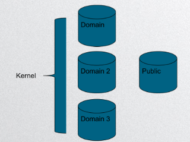
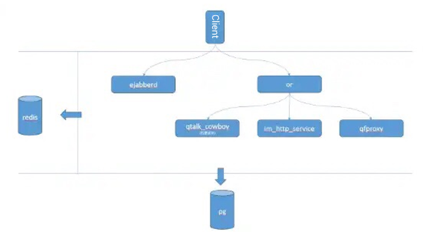

Startalk, The Best open sourced instant messenger software in the world!

* [Chinese Version(中文版)](https://github.com/qunarcorp/qtalk/blob/master/README.zh_CN.md)
* [Startalk](#Startalk---Solution-for-Instant-Message)
* [Application Scenarios](#Application-Scenarios)
* [Characteristics of Startalk](#Characteristics-of-Startalk)
* [How to Use](#How-to-Use)
  * [Requirements for the Environment of Deployment](#Requirements-for-the-Environment-of-Deployment)
  * [Start](#Start)
  * [How to Integrate Your Own App in Startalk](#How-to-Integrate-Your-Own-App-in-Startalk)
  * [Official Website](https://im.qunar.com/#/)
  * [Characteristics of the System](#Characteristics-of-the-System)
  * [Decentralized Design and the Way of Deployment](#Decentralized-Design-and-the-Way-of-Deployment)
* [FAQ](#FAQ)
* [Our Partners](#Our-Partners)
  
# Startalk - Solution for Instant Message

Communication is a fundamental need of humankind. – “Sapiens: A brief history of humankind”

Startalk is going to be a universal, high-performance IM software for business. Currently, there is a lack of open-sourced IM systems in the world. Startalk is changing this situation.

The predecessor of Startalk is Qtalk, which have ran smoothly in Qunar for more than 3 years. The core of Startalk plays a role of customer service tool in Qunar.

In other words, a single core has solved Qunar’s problem of communication internally and externally.

# Application Scenarios

- OA
-	Customer service system for business
-	First-party SDKs for multiple IM situations

# Characteristics of Startalk

-	Open-sourced
```comment
We are transferring our focus from git of our company to Github, aiming to provide you services that are stable and long-lasting.
```
-	Private deployment is highly recommended
```comment
Private deployment is the need for businesses. Taking efficient communication and expansibility as basics, we try our best to help enterprises.
```

# How to Use

Startalk focuses on private deployment, which leads to the complexity of the log-in process of Startalk. Luckily, our team not only made the process of designing IM system easy, but also decrease the cost of it.

Usually, when you are going to use an app, there are three steps for you to get access to it:
-	Download the app
-	Modify settings based on guide
-	Sign-up & Log-in

However, since Startalk focuses on private deployment, the server of app needs to be deployed in your company. Therefore, there are four steps for you to get access to Startalk:
-	Download the app
-	Deploy the backstage system
-	Modify client app through backstage configuration
-	Import accounts & Log-in

If you want to try private deployment without cost, you can try it in [public domain](https://im.qunar.com/new/#/register)

If you have decided to use [private deployment](https://github.com/qunarcorp/ejabberd-open#startalk-ejabberd) or transfer your data from public to private domain.. Let’s begin!

## Requirements for the Environment of Deployment

-	[Back-end server](https://github.com/qunarcorp/ejabberd-open) centos 7 (allows Ubuntu and various kinds of private cloud in the future)
-	[IOS SDK](https://github.com/qunarcorp/imsdk-ios), minimum requirement: IOS 9 
-	[Android SDK](https://github.com/qunarcorp/imsdk-android), minimum requirement of API: 16
-	Compiled [Android SDK](https://github.com/qunarcorp/imsdk-android), minimum requirement of API: 26
-	[Windows 1.0](https://github.com/qunarcorp/open_source_startalk) windows vs2012 qt 5.2.1
- [PC 2.0](https://github.com/qunarcorp/startalk_pc_v2) include three platforms: Windows, Mac, and Linux; minimum requirement of qt: 5.9; minimum requirement of Cmake: 3.12
-	[Web](https://github.com/qunarcorp/startalk_web) recommended environment of deployment: node 8.6.0 npm 5.3.0 (node@>=7.6.0; npm@>=3.0.0; pm2@>=2.0.0)
-	Other platforms can use C++14 to compile. Interface is [qt](https://qt.io/).

---------Let’s test it!!!!!---------

## Start

-	[Ejabberd](https://github.com/qunarcorp/ejabberd-open) back end source code and introduction
-	[Imsdk-android](https://github.com/qunarcorp/imsdk-android) source code and introduction
-	[Imsdk-iOS](https://github.com/qunarcorp/imsdk-ios) source code and introduction
-	[Windows 1.0](https://github.com/qunarcorp/open_source_startalk) source code and introduction
- [PC 2.0](https://github.com/qunarcorp/startalk_pc_v2) source code and introduction
-	[Web](https://github.com/qunarcorp/startalk_web) source code and introduction

If you want to start quickly, please enter our [official website](https://im.qunar.com/#/) to sign up an account for test in [public domain](https://im.qunar.com/new/#/register).

## How to Integrate Your Own App in Startalk

Startalk allows users to redevelop it to integrate their own app in Startalk, in order to achieve customization. Startalk Pro provides backstage for you to upload app; after deployment, you can embed your app (RN or H5) through backstage configuration.[More information](application.md)

## [Official Website](https://im.qunar.com/#/)

For different customers, we have different solutions. If you are interested, please see our [official website](https://im.qunar.com/#/).

## Characteristics of the System

-	Focus on user experience and data security
-	Allows end-to-end encryption. Use TLS connection, completely binary protocol
-	Allows all types of messages: text, emoji, file, audio, video, photo, location, red packet, code, etc.
-	Allows access to all platforms
-	Decentralized design. Allow private cloud or public cloud deployment.

### Include the functions below:
-	DM and group chat
-	Search
-	Push
-	Audio and video chat
-	Red packet and split bill
-	Encrypted conversation
-	Organization structure
-	OA for business

## Decentralized Design and the Way of Deployment


1.	Separations between each domain
2.	Users are connected to domains
3.	Domain can be enlarged horizontally
4.	Public can be used by multiple domains

The design of Startalk is decentralized, which integrated non-state service into public and state service into domains. 


As long as you have a server, you can deploy an IM system in your home!!

## Back-end Modules


Startalk includes:

- [Ejabberd](https://github.com/qunarcorp/ejabberd-open): the core component of IM. It maintains the connection with client app and message routing
- [Or](https://github.com/qunarcorp/or_open): the load balancing component of IM. It verifies the identity of client app and forwards the request from http to the corresponding backstage services
- [Im_http_service](https://github.com/qunarcorp/im_http_service_open): Port service of IM HTTP. It takes charge of searching the data and settings, as well as synchronizing the chat history (a java service based on tomcat).
- [Qtalk_cowboy](https://github.com/qunarcorp/qtalk_cowboy_open) (this service will be discarded in the future since all of ports will be move to im_http_service) : port service of IM HTTP It takes charge of searching the data and settings, as well as synchronizing the chat history.
- [Qfproxy](https://github.com/qunarcorp/qfproxy_open): IM file service. It takes charge of uploading and downloading the file (a java service based on tomcat).
- [Push_service](https://github.com/qunarcorp/push_service_open): Push service in IM. It pushes off-line messages (a java service based on tomcat).
- [Qtalk_search](https://github.com/qunarcorp/qtalk_search): It provides the service to search people and groups remotely
- Redis: Caching service in IM
- Postgresql: database service in IM

## Client-side Modules

Android
- [Imsdk-android](https://github.com/qunarcorp/imsdk-android) Android SDK 

iOS
- [imsdk-iOS](https://github.com/qunarcorp/imsdk-ios) ios SDK
- [libqimkit-ios-cook](https://github.com/qunarcorp/libqimkit-ios-cook) Pod library of components
- [libqimcommoncategories](https://github.com/qunarcorp/libqimcommoncategories-ios) library pf extended tools
- [libqimdatabase](https://github.com/qunarcorp/libqimdatabase-ios) component library of data library
- [libqimopenssl](https://github.com/qunarcorp/libqimopenssl-ios) OpenSSL Library that applicable to ios/Mac

Windows
- [Windows](https://github.com/qunarcorp/open_source_startalk) source code

PC 2.0(include Windows, Mac, and Linux)
- [PC 2.0](https://github.com/qunarcorp/startalk_pc_v2)

Web
- Source code for [Web](https://github.com/qunarcorp/startalk_web)

# FAQ
See [FAQ](https://github.com/qunarcorp/qtalk/issues)

# Our Partners

[architecture](image/yakang.png)[architecture](image/weicha.png)
